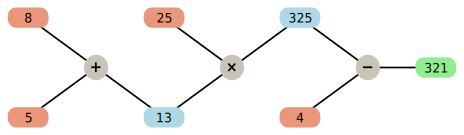

# JChiffresFX – A Chiffres Game solver

**JChiffresFX** is an application for solving the **»Chiffres«** part of the game »[Des chiffres et des lettres](https://fr.wikipedia.org/wiki/Des_chiffres_et_des_lettres)«. It will find all solutions (in the form of a sequence of binary operations) while filtering out duplicate and redundant solutions.

You can see some [screenshots here](screenshots.md).

The **objective of the game** is to calculate (in your head and with a time limit, e.g. 40 seconds) a given three digit number from 6 given numbers (in the range 1 to 10, 25, 50, 75, 100) using elementary arithmetic. Each of the given 6 operands must be used at most once.

## Example

Let the numbers given be 25, 4, 2, 10, 8, 5 with the calculation goal 321. Then there is a possible solution:

      8 +  5 =  13
     25 * 13 = 325
    325 -  4 = 321

The user interface has _3 modes_ with the following characteristics:

### Standard Game

The Toolbar-Button **»Standard Game«** opens a new tab to input a game according to the standard rules with simple mouse clicks. After a click on **»Start!«** all possible solutions will be calculated and displayed in a table, filtering out duplicate and redundant solutions. The solution in the selected table row will be displayed graphically. It is also possible to mark solutions with a checkbox. Those selected solutions will be accessible through tabs in the graphical view, and a click on **»Sort Sel.«** will sort them to the beginning of the table.

### Random Game

The Toolbar-Button **»Random Game«** opens a new tab with given random numbers which otherwise works like the tab **»Standard Game«**.

### Extended Mode

The Toolbar-Button **»Extended Mode«** allows to use the calculator beyond the original game rules in a more general way, e.g. with a variable number of operands. The slider **»Number of threads to use for computation«** allows to use a variable number of CPU cores.

Hint: To find an existing solution in the table, the easiest way usually is to use the **»Sort last … first«** button to sort the table **»backwards«** from the last to the first column. Start searching the last operation in the according column, then the second to last, and so on.

It is possible that no exact solution exists (e.g.: 1, 2, 3, 4, 5, 6 with goal 999). In this case the calculator searches for the best possible upper and lower narrowing solutions.

The Button **»Clone Tab«** opens a new tab initialized with the same operands as the current tab. This allows to intentionally search for a narrowing solution, even if there is an exact solution.

## Building the application

Have a recent JDK installed, get the sources and run from the root directory:

`> ./gradlew run`

to run the application immediately or

`> ./gradlew installDist`

to build the application into the `./build/distributions` directory.
